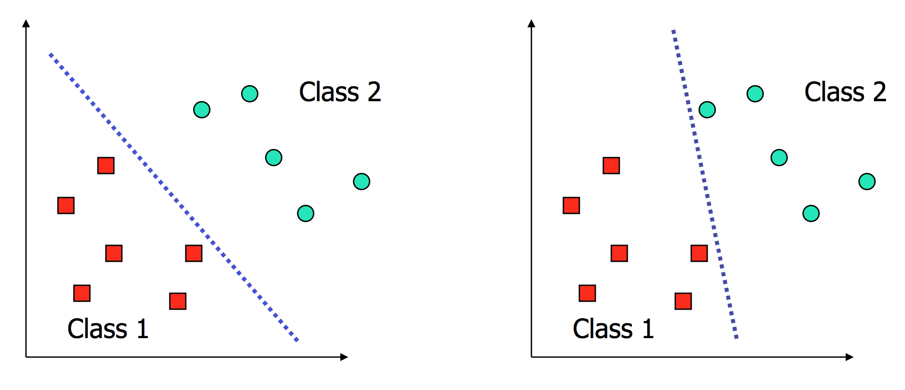
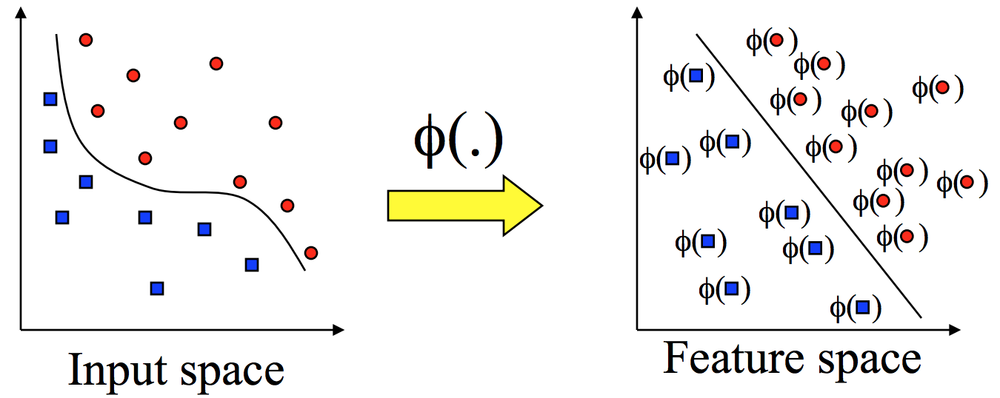
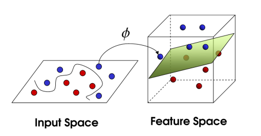
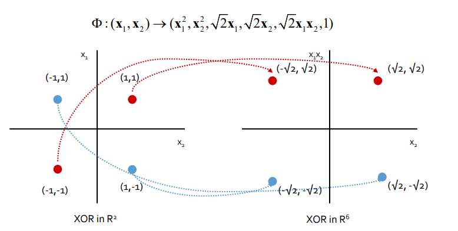
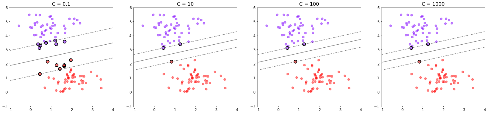
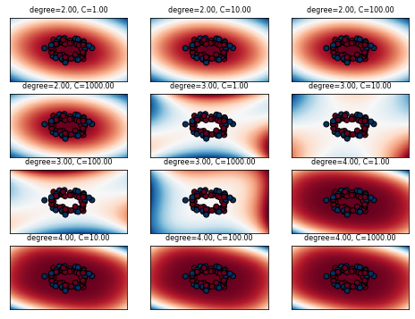
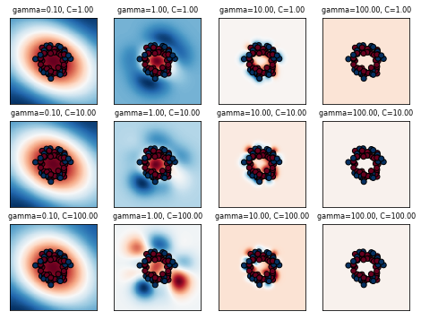

# Business Analytics
# **[Ch.2] Kernel-based Learning**

## 📂 Contents
-----------------------------
* Background
* Support Vector Machine
* Dataset
* Result
* Analysis

-----------------------------
### :pushpin: Background

* Support Vector Machine

  * Support Vector
    - 두 클래스 사이의 결정 경계에 위치한 데이터 포인트들
  * Margin
    - 결정 경계와 support vector 사이의 거리
    - 최적의 결정경계는 마진(margin)을 최대화함
    - C 를 이용하여 조절 : c값이 클수록 오류를 허용하지 않는 hard margin에 가까워지고, c값이 작을수록 오류를 어느정도 허용하는 soft margin에 가까워집니다.
   - Hard
    - 개별적인 데이터를 다 놓치지 않고 아웃라이어(outlier)를 허용하지 않는 기준으로 결정 경계를 정해버리면 오버피팅(overfitting) 문제가 발생할 수 있습니다.
   - Soft
    - hard margin과 다르게 마진을 벗어나는 경우를 어느정도 허용합니다.

* Kernel

> 비선형 데이터를 잘 다루기 위해 kernel을 이용하고자 하고 있습니다. 
> kernel의 종류는 다음과 같이 linear, polynomial, Radial Basis Function (RBF) 등이 있습니다.

- Linear Kernel

- Polynomial Kernel
  $$ K(x,y) = (x \cdot y + c)^d , c>0$$

- Radial Basis Function Kernel|
  $$ K(x, y) = exp(- \frac {\|x - y\|^2}{2 \sigma^2}) , \sigma \neq 0$$

- Sigmoid kernel
  $$ K(x,y) = tanh(a(x \cdot y + b)), a,b \ge 0 $$

## :books: Support Vector Machine
-----------------------------
#### 💬 Questions
- [x] scaling의 영향
- Scaler는 다음과 같이 3가지를 이용합니다
    1. Standard Scaler : 기존 변수를 정규 분포로 변환
    2. MinMax scaler : 데이터의 값들을 0~1 사이의 값으로 변환
    3. Robust scaler : 중위수 (median) 과 IQR (사분위수) 를 이용하여 변환
- [x] 비선형 데이터셋을 이용하는 경우
- [x] parameter search
    
#### [Tutorial]

### 📂 Dataset
----------------------------
* Star Dataset for Stellar Classification [download](https://www.kaggle.com/datasets/vinesmsuic/star-categorization-giants-and-dwarfs)

### :bar_chart: Result
-----------------------------
|**SCALE**|일반|Standard Scaler|Minmax Scaler|Robust Scaler|
|:--:|:--:|:--:|:--:|:--:|
|**Accuracy**|0.8911|0.8911|0.8930|0.8920|

### 📊 Analysis
------------------------------
- Scaling
scaling을 진행하지 않은 경우에는 0.8911, standardscaler를 이용한 경우 0.8911, MinMaxScaler를 이용한 경우 0.8930, Robust scaler를 이용한 경우 0.8920으로 약강의 성능 향상이 있긴 했으나 생각보다 크게 차이가 많이 나지 않는 모습을 보였습니다. 데이터 자체의 분포에서 taget이 많이 balancing 되어있었기 때문에 이러한 결과가 나타난 것으로 생각됩니다.

- Linear kernel

SVM에서 parameter C는 주로 error term에 대한 penalty parameter로 쓰게 됩니다. 위의 그래프에서 C의 값이 커짐에 따라 hard margin이 형성되고 margin안에 많은 점이 허용되지 않게 됩니다. 반면에 작은 C의 값을 가지게 되면 soft margin이 형성되게 되고 몇몇 점들이 margin안에 위치하는 것을 허용하게 됩니다. 하지만, linear kernel 이용시 위의 경우 C의 값에 따라 accuracy의 변화는 없는 점을 확인할 수 있습니다. 이는 그래프에서 확인할 수 있듯이 C를 통해 margin 안에 어느 정도의 데이터가 들어오는 것을 허용하는지 조절하고 있고, training example의 정확한 분류와 decision function의 margin 최대화 사이의 tradeoff 조절함에 있어 균형이 맞아 동일한 accuracy가 나오는 것으로 해석할 수 있습니다.

- Polynomial kernel

Polynomial kernel 이용시 degree별로 대부분의 accuracy값이 일정하게 나타나며, degree가 고정되어 있을 때, C의 영향력이 크지 않은 것으로 나타났습니다. 여기서 값이 높을수록 더 flexible한 boundary를 나타내는 degree의 영향력이 penalty term인 C의 영향력보다 컸다고 할 수 있으며, C = 100 또는 1000, degree = 2의 값을 가질 때, 0.7333으로 가장 높은 accuracy값을 보였음을 알 수 있습니다. polynomial kernel을 쓰는 경우 nonlinear decision boundary를 잘 형성할 수 있기 때문에 이때, flexible한 boundary 생성을 조절하는 degree의 영향력이 컸을 것이라고 말할 수 있습니다.

- RBF kernel

RBF kernel의 경우 gaussian distribution의 유사도를 이용하기 때문에 C와 gamma값에 따라 variance에 영향을 많이 주고, 결론적으로 성능에도 차이가 나타나는 것으로 해석할 수 있습니다.

- parameter값에 따른 variance와 bias의 변화는 다음과 같이 정리할 수 있습니다

|**Parameter**|큰 gamma|작은 gamma|큰 C|작은 C|
|:--:|:--:|:--:|:--:|:--:|
|**Variance**|낮음|높음|높음|낮음|
|**Bias**|높음|낮음|낮음|높음|

#### **🗂️ SVM의 장단점**
---
- 장점 
    - 다양한 feature값을 가지는 데이터셋에 효과적
    - decision function에 있어 여러 종류의 kernel function 사용 가능

- 단점 
    - feature들의 수가 데이터 수보다 클 때 over-fitting을 방지하기 위해 kernel function과 regularization term을 적절히 고르는게 필수적
    -  training 시간이 오래 걸리기 때문에 작은 sample set에 잘 작동함
    - 예측이 어떻게 결정되었는지 이해하고 어려움

### 📂 References
------------------------------
* https://github.com/pilsung-kang/Business-Analytics-IME654-
